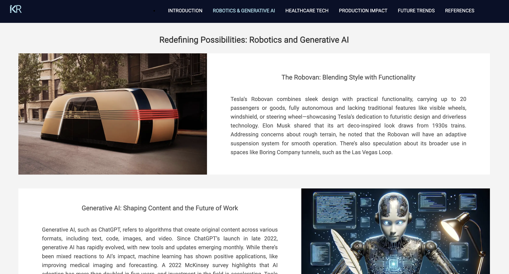

# Technological Innovation Explorer

**Technological Innovation Explorer** is a dynamic, informative website created with **HTML, CSS, and JavaScript**, designed to showcase advancements in technology, including robotics, AI, healthcare, and future trends.

## Features
- **Interactive Homepage**: Engaging design with animations and informative sections.
- **Dynamic Secondary Pages**: Alternating card layouts for a visually immersive experience.
- **Data Visualization**: Google Charts integration for presenting trends effectively.
- **Responsive Design**: Fully optimized for mobile, tablet, and desktop viewing.
- **Functional Form**: Includes PHP-based form handling for user interactions.

---

## Preview

### Homepage  


### Secondary Page  


## Design Wireframes
You can view the design wireframes for the project on Figma:  
[View Figma Design: Ramanujam Kalpalathika Research Wireframes](https://www.figma.com/design/Fa9xAM1saN1ySnkEGZxNAL/Ramanujam_Kalpalathika_Research_Wireframes?node-id=0-1&t=UC5d2M5oUGblQDVK-1)


---

## Technologies Used
- **Frontend**: HTML, CSS, JavaScript  
- **Libraries**: Google Charts  
- **Design**: Canva (for logo and favicon)  

---

## How to Run
1. Clone the repository:  
   ```bash
   git clone https://github.com/username/repo.git

2. Open the index.html file in your browser to view the project.
